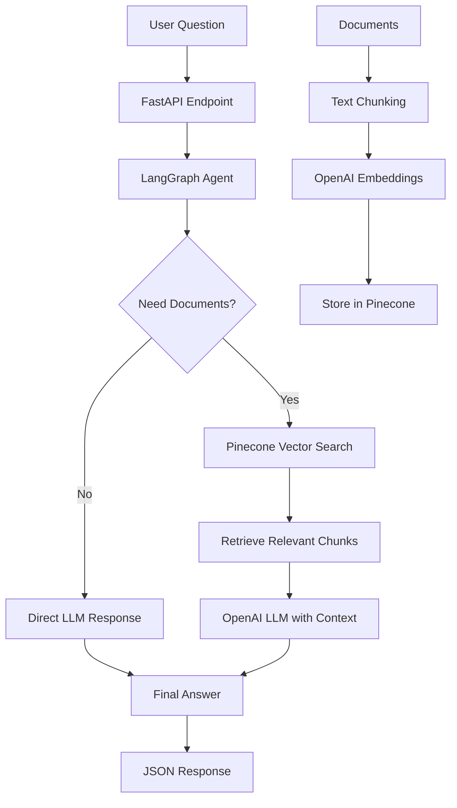

# 🧠 AI Document Support Agent for Internal Teams

## Real-Life Scenario

Imagine you work at a mid-sized company where employees frequently ask repetitive questions like:

- *"How do I apply for leave?"*
- *"What's the policy for travel reimbursements?"*
- *"How does the onboarding process work?"*

The HR team maintains all this information across several internal documents — PDFs, handbooks, Notion exports — but employees don't want to search through them every time.

## Objective

Your job is to build a smart, AI-powered assistant that can:

- ✅ Accept a question in natural language
- ✅ Decide whether to pull information from internal documents
- ✅ Retrieve relevant content from those documents
- ✅ Generate a helpful and accurate response using an LLM
- ✅ Send the answer back to the user — through a web app or automation (e.g. email, Slack)

## 🛠️ Technical Requirements

### 1. 📄 Document Processing

- Take internal documents (e.g., HR policy PDFs or onboarding guides)
- Break them into searchable pieces (chunks)
- Convert them into embeddings (using OpenAI)
- Store these embeddings in Pinecone so they can be retrieved based on semantic meaning

### 2. 🤖 Design an AI Agent (Using LangGraph)

Build a multi-step AI agent using LangGraph that:

- Receives a user's question
- Decides whether it needs to consult the documents
- Retrieves relevant chunks from Pinecone if needed
- Constructs a complete prompt with context
- Calls an LLM (e.g., OpenAI GPT-3.5) to generate a clear answer

### 3. 🌐 Expose it via API

Build a simple FastAPI backend that:

- Accepts POST requests with a question
- Returns a JSON response with the AI-generated answer
- This makes it usable in real applications — like chatbots, web forms, or Slack bots

### 4. 🔁 (Optional) Integrate With Zapier

Use Zapier to:

- Capture user queries from a Google Form or Slack message
- Send the query to your FastAPI endpoint
- Send the answer back via Gmail, Slack, or other tools

## 📋 Deliverables

### Required Files

| File | Description |
|------|-------------|
| `embed.py` | Script to load and embed documents |
| `main.py` | LangGraph agent with conditional logic |
| `api.py` | FastAPI server to receive and return answers |
| `test_queries.py` | Test scripts for different question types |
| `README.md` | Architecture, setup, and example outputs |

### Optional

- Demo link or Loom video walkthrough

## 🎯 The End Goal

A fully functional AI support agent for internal documents, powered by:

- **LangGraph** - For intelligent agent workflow
- **Pinecone** - For vector storage and semantic search
- **OpenAI** - For embeddings and language model
- **FastAPI** - For API endpoint
- **Zapier** (Optional) - For real-world workflow integration

The system will be accessible via an API and optionally connected to real-world workflows, providing instant, accurate answers to employee questions from internal documentation.

## 🏗️ Architecture Overview

## 🚀 Getting Started

1. **Set up environment variables** for OpenAI and Pinecone API keys
2. **Process documents** using `embed.py`
3. **Start the FastAPI server** with `api.py`
4. **Test queries** using `test_queries.py`
5. **(Optional)** Set up Zapier integration for real-world workflows

